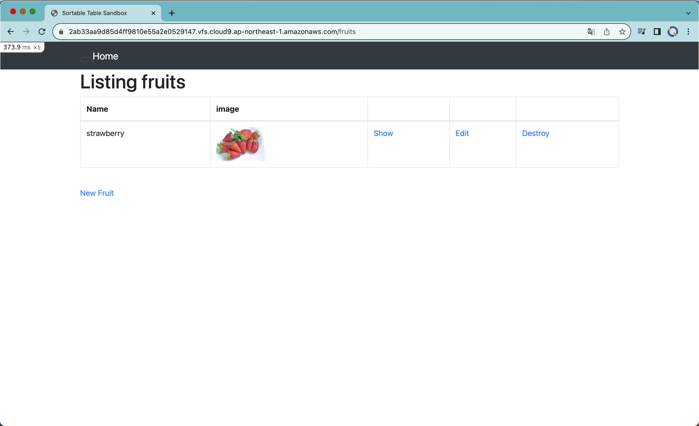

# 第3回課題

## Cluod9でのサンプルアプリケーションの起動

## 利用しているAPサーバについて
- 名前：Puma 
- Version: 5.6.5 
  ### 終了時の動作
  503エラーとなり、アクセス不可になった。
  ### 再起動について
  bin/cloud9_devと入力することでスクリプトが実行され、APサーバが再起動し、  
  Web画面を更新することで正常に再起動したことを確認した。

## 利用しているDBサーバについて
- DBエンジン: MySQL
- Version: 8.0.35
  ### 終了時の動作
  コマンドによってMySQLを終了させて、Webサイトにアクセスしたところ、  
  500エラーとなり「Can't connect to local MySQL server」と表示され、  
  アクセス不可になった。

## Railsの構成管理ツールに関して
- Bundler  
  gemの依存関係を管理している。

## 課題を通して（総括）
環境構築を通して、Webアプリケーションがどのような要素で構成されているかを学びました。また、エラー内容を正しく読み取ることで、多くの問題は解決することを学びました。  
今後の課題でもエラーが発生することは多いと思うので、ログを確認するのは癖づけていきたいと思います。