# 第4回課題
## 1.VPCの作成
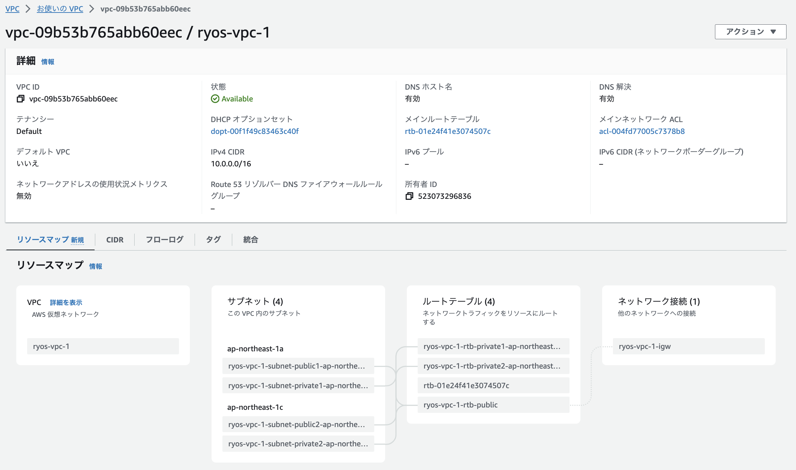

## 2.EC2とRDSの構築
### EC2
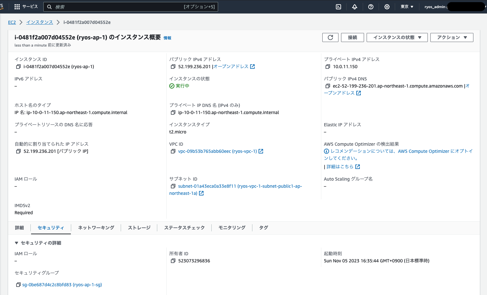

#### EC2のサブネット（public-subnetの確認）
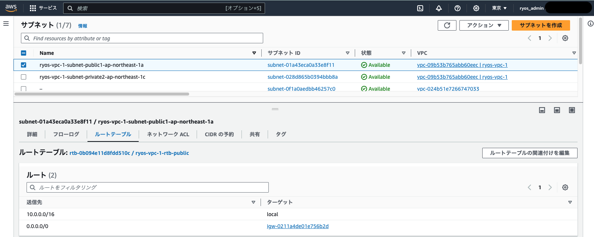

#### EC2のセキュリティグループ
- インバウンド
  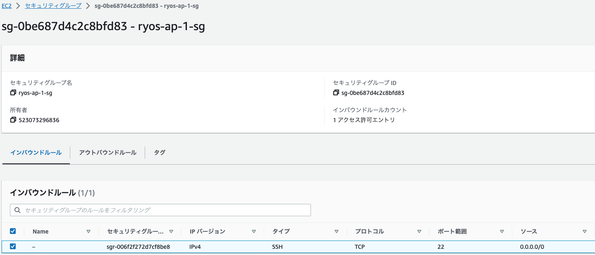

- アウトバウンド
  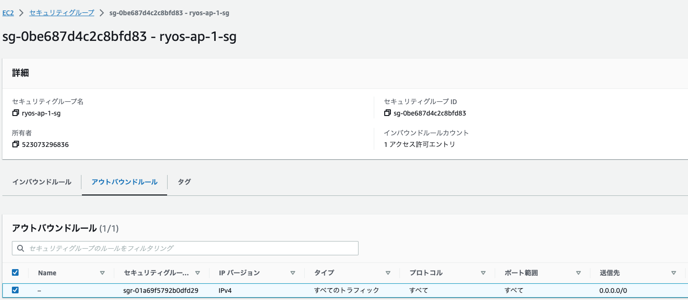

### RDS
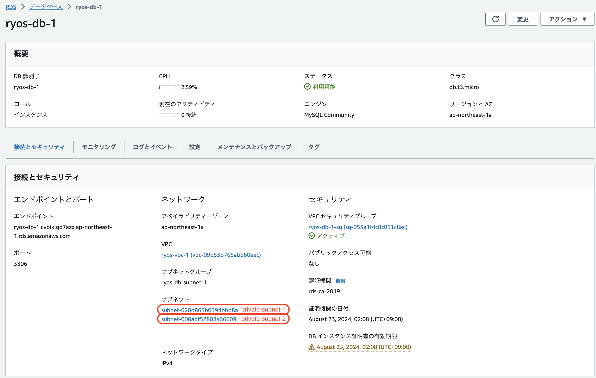
#### RDSのサブネット（private-subnetの確認）
- private-subnet-1
  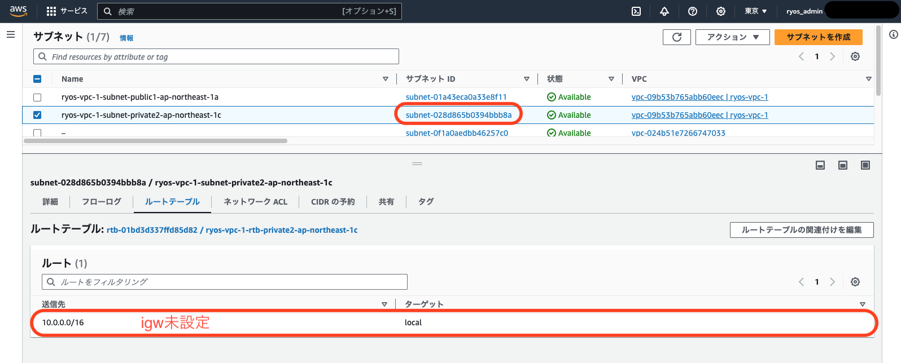
- private-subnet-2
  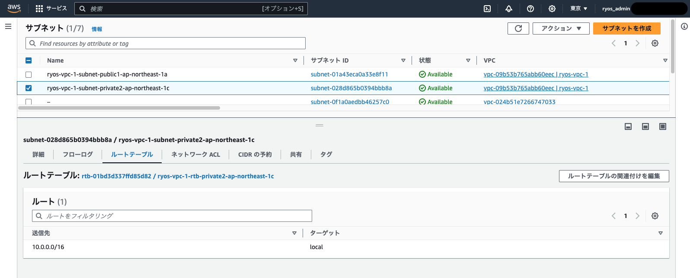

#### RDSのセキュリティグループ
- インバウンド
  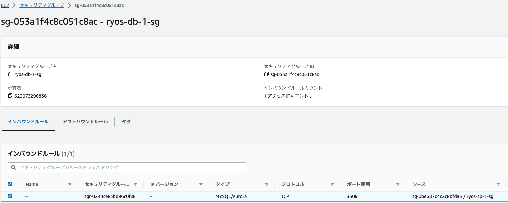

- アウトバウンド
  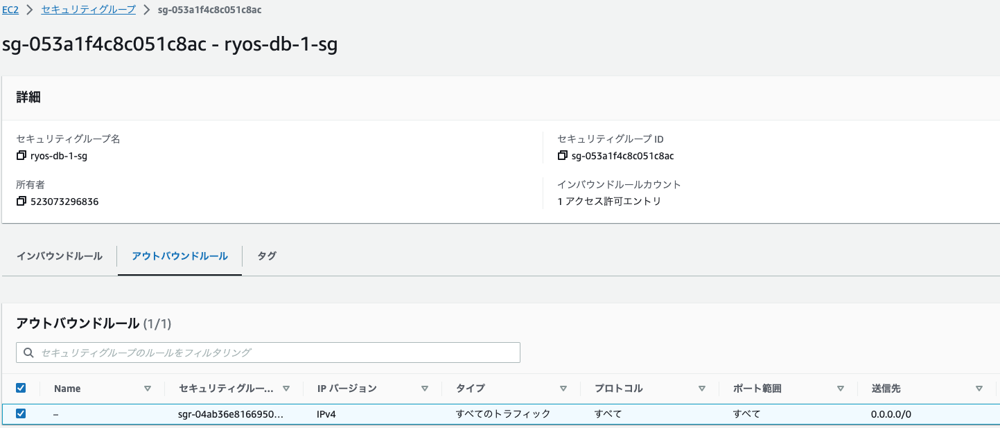

## 3.EC2→RDSへの疎通確認
### EC2 Instance Connectより、RDS上のMySQLにログイン
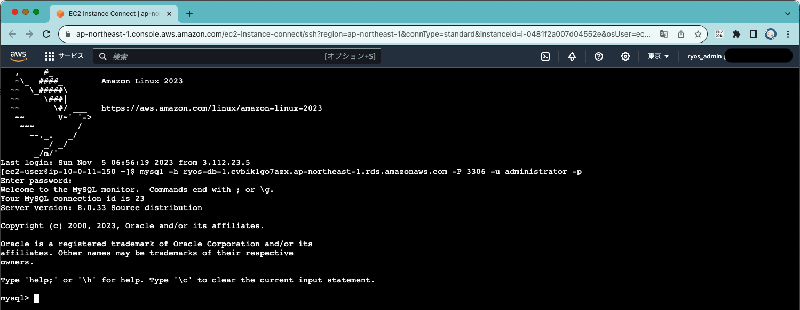