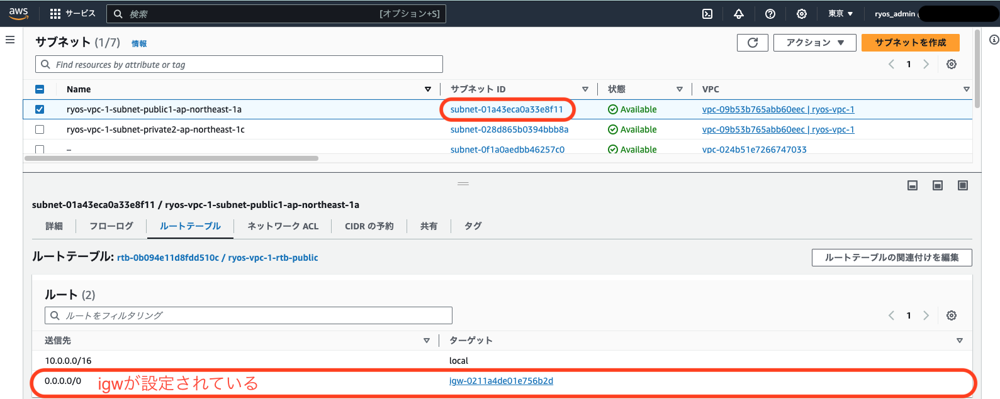
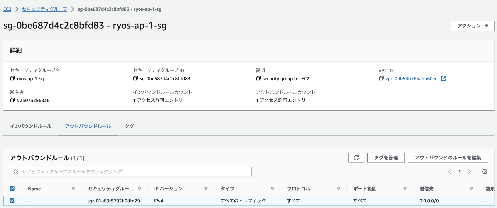

# 第4回課題
## 1.VPCの作成

## 2.EC2とRDSの構築
### EC2

#### サブネット（パブリックサブネット）

#### セキュリティグループ
- インバウンド
  

- アウトバウンド
  

### RDS

#### サブネット（プライベートサブネット）

#### セキュリティグループ
- インバウンド
  

- アウトバウンド
  

## 3.EC2→RDSへの疎通確認
### EC2 Instance Connectより、RDS上のMySQLにログイン
