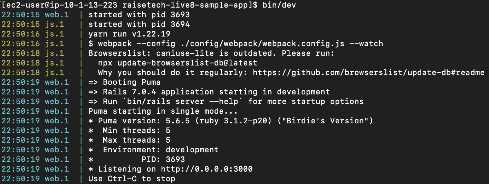

# 第5回課題
## 課題で学ぶこと
### 1.EC2を利用した、アプリ動作環境構築
### 2.ELB(ALB)を利用した、アプリ動作環境の冗長化
### 3.S3サービスの活用
### 4.AWS構成図の作成

## 1-1.組み込みサーバアプリ(Puma)単体でのアプリ動作環境構築
### ・Pumaの設定
#### /var/www/raisetech-live8-sample-app/config/puma.rb

### (1)bin/devでアプリケーション実行後、サーバのIPアドレス:3000(Pumaで利用しているポート番号)にアクセスし、アプリが動作していることを確認

## 1-2.Webサーバアプリ(Nginx)とAPサーバアプリ(Unicorn)に分割した環境でのアプ動作環境構築
### ・Nginxの設定
#### /etc/nginx/nginx.conf

### ・Unicornの設定
#### /var/www/raisetech-live8-sample-app/config/unicorn.rb

### (1)Nginxの起動

### (2)Unicornの起動

### (3)サーバのIPアドレス:81(Nginxで利用しているポート番号)にアクセスし、アプリが動作していることを確認

## 2.ELB(ALB)を利用した、アプリ動作環境の冗長化
### ・冗長化のためのサーバの作成
#### 1-2で作成した環境(Nginx-Unicorn-lecture05)をもとに、冗長化のためのサーバ(Nginx-Unicorn-lecture05-2)を作成

### ・ターゲットグループの作成
#### 2つのサーバをターゲットグループに指定

### ・ロードバランサー(ALB)の作成
#### 作成したターゲットグループを設定したロードバランサーを作成

### ・動作確認のために、アプリTOPページの文言を変更
#### サーバ1(Nginx-Unicorn-lecture05)
##### /var/www/raisetech-live8-sample-app/app/views/fruits/index.html.slim

#### サーバ2(Nginx-Unicorn-lecture05-2)
##### /var/www/raisetech-live8-sample-app/app/views/fruits/index.html.slim

### (1)ロードバランサーのDNS名:81(Nginxで利用しているポート番号)にアクセスし、アプリが動作していることを確認

### (2)現在アクセスしているサーバを停止し、ページを更新することで、冗長化されていることを確認

## 3.S3サービスの活用
### 1〜2で作成したアプリの環境において、画像投稿時のファイルの保存先を、サーバ内→S3に変更する。
### ・S3バケットの作成

### ・ストレージの設定を変更
#### /var/www/raisetech-live8-sample-app/config/environments/development.rb

#### /var/www/raisetech-live8-sample-app/config/storage.yml

#### 環境変数(/home/ec2-user/.bashrc)

### (1)アプリ上で画像を投稿
#### 保存前

#### 保存後

#### 保存後のS3バケット内のオブジェクト

## 4.AWS構成図の作成
### 1~3で作成したアプリ動作環境のAWS構成図を作成
