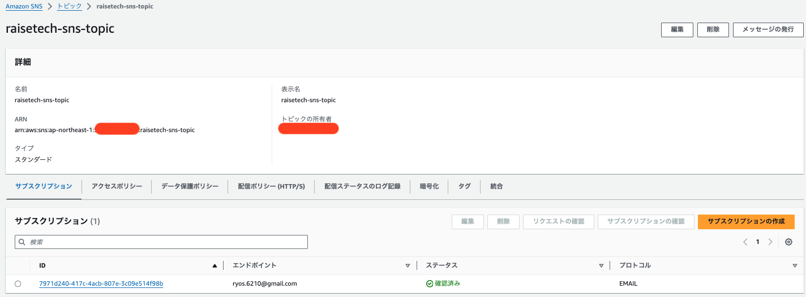

# 第6回課題
## 課題で学ぶこと
### 1.CloudTrailによる、AWSサービスの操作ログの確認
### 2.CloudWatch・Amazon SNSによる、AWSサービスの異常検知の通知設定
### 3.AWS Pricing Calculatorによる、AWSサービス利用料の見積の作成
### 4.Cost Explorerによる、AWSサービス利用料の確認

## 1.CloudTrailによる、AWSサービスの操作ログの確認
### 操作ログを参照し、どのような情報が取得されているかを確認する。
### (1)CloudTrail＞イベント履歴より、 &nbsp;&nbsp;&nbsp;&nbsp;&nbsp;イベント名：StartInstances(EC2インスタンス起動)のログを確認

### (2)どのような情報が確認できるか(3つピックアップ)
### ・イベント時間(3月 20, 2024, 13:50:06 (UTC+09:00))・・・いつ行われた操作か 
### ・ユーザー名(ryos_admin)・・・どのユーザーによる操作か
### ・AWSリージョン(ap-northeast-1)・・・どのリージョンで行われた操作か

## 2.CloudWatch・Amazon SNSによる、AWSサービスの異常検知の通知設定
### CloudWatchアラームを使ってALBのアラームを設定し、異常検知時にメール通知が行われるようにする。 動作確認については、<a href="https://github.com/ryos621/RaiseTech_lecture/blob/main/lecture05.md">第5回の課題</a>で作成した環境にて行う。
### 2-1.Amazon SNSの設定
### (1)SNSトピックの作成

### (2)SNSトピックに関連付けるサブスクリプションの作成

### (3)設定完了

### 2-2.CloudWatchアラームの設定
### (1)メトリクスと条件の指定
### ・メトリクス
### <a href="https://github.com/ryos621/RaiseTech_lecture/blob/main/lecture05.md">第5回の課題</a>で作成したALBのターゲットグループの一分間あたりの平均ヘルスチェック失敗数
### ・アラーム条件
### 平均ヘルスチェック失敗数が1以上の場合

### (2)アクションの設定
### 状態が「OK」または「アラーム状態」に遷移した時に、 2-1で作成したSNSトピック(エンドポイント:ryos.6210@gmail.com)に通知を送信

### (3)設定完了

### 2-3.動作確認
### 2-1と2-2を設定した状態で、<a href="https://github.com/ryos621/RaiseTech_lecture/blob/main/lecture05.md">第5回の課題</a>で作成したアプリの使用可↔︎使用不可を切り替えて、動作確認を行う。
### ・最初の状態(ターゲットに設定されている全てのインスタンスのヘルスステータス:Healthy)

### (1)アプリを使用可→使用不可に変更(アラーム状態遷移時の動作確認)
### インスタンス上で起動しているNginxを終了させて、アプリを使用可能→使用不可に変更

### ・ターゲットグループ(ヘルスステータスがHealthy→Unhealthyに変更されている)

### ・CloudWatchアラームの状態(アラーム状態)

### ・SNSトピックに設定したメールアドレスで通知の受信を確認

### (3)アプリを使用不可→使用可能に変更(OK状態遷移時の動作確認)
### インスタンス上のNginxを再起動させて、アプリを使用不可→使用可に変更

### ・ターゲットグループの状態(ヘルスステータスがUnhealthy→Healthyに変更されている)

### ・CloudWatchアラームの状態(OK)

### ・SNSトピックに設定したメールアドレスで通知の受信を確認

## 3.AWS Pricing Calculatorによる、AWSサービス利用料の見積の作成
### <a href="https://github.com/ryos621/RaiseTech_lecture/blob/main/lecture05.md">第5回の課題</a>までに作成したリソースの見積を作成
### <a href="https://calculator.aws/#/estimate?id=2c0a28c679a09696b0f8360eb9b34636d20a7d4e">見積リンク</a>
## 4.Cost Explorerによる、AWSサービス利用料の確認
### ・日付範囲:先月(2024/02/01-2024/02/29)
### ・サービス:EC2インスタンス(Elastic Compute CLoud - Compute)
### でフィルタリングすることで、先月のEC2インスタンス利用料金を確認
